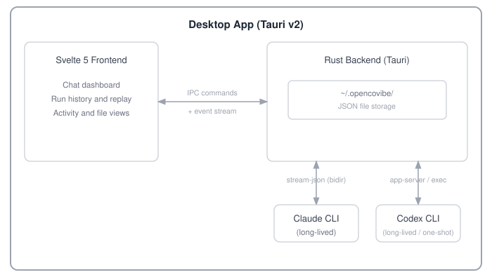

<p align="center">
  
</p>

<p align="center">
  <strong>Local-first desktop app for AI-assisted vibe coding</strong>
</p>

<p align="center">
  <a href="#why-opencovibe">Why</a> &middot;
  <a href="#key-capabilities">Capabilities</a> &middot;
  <a href="#quick-start">Quick Start</a> &middot;
  <a href="#supported-providers">Providers</a> &middot;
  <a href="#architecture">Architecture</a> &middot;
  <a href="#license">License</a>
</p>

---

<p align="center">
  
</p>

## Why OpenCovibe?

AI coding CLIs like Claude Code and Codex are powerful, but their terminal-first interfaces make long-running work, visual review, and cross-session management harder to follow. OpenCovibe wraps these CLIs with a native desktop UI that adds a persistent dashboard, structured tool activity, visual diffs, and searchable run history — while keeping app data **stored locally**. Remote model APIs still require network access; OpenCovibe itself has no cloud backend.

| Agent                                                    | Status                                                                                |
| -------------------------------------------------------- | ------------------------------------------------------------------------------------- |
| [Claude Code](https://github.com/anthropics/claude-code) | Supported                                                                             |
| [Codex](https://github.com/openai/codex)                 | Supported — experimental interactive `app-server` mode (default) with `exec` fallback |

**Platform status**: Pre-built packages are available for **macOS 13+** (Apple Silicon and Intel) and **Windows 10+ x64**. Linux is supported through source builds. Development and testing are still primarily performed on macOS, so Windows and Linux bug reports are especially welcome.

**Core principle**: Wrap the CLI, surface the work, keep it local.

## Key Capabilities

### What OpenCovibe adds

| Capability                   | What OpenCovibe adds                                                                                                                                           |
| ---------------------------- | -------------------------------------------------------------------------------------------------------------------------------------------------------------- |
| **Visual Tool Cards**        | Every tool call (Read, Edit, Bash, Grep, Write, WebFetch, …) rendered as an inline card with syntax-highlighted diffs, structured output, and one-click copy   |
| **Run History & Replay**     | Browse all past sessions, full event replay, resume / fork from any point, soft-delete with recovery                                                           |
| **Multi-Provider Switching** | Use Claude Code with built-in presets for Anthropic-compatible providers, gateways, and local runtimes — hot-switch without restarting                         |
| **Remote Browser Access**    | Token-protected embedded web server for browser access over LAN or HTTP tunnels (ngrok / cloudflared)                                                          |
| **File Explorer**            | Browse and edit project files with syntax highlighting, markdown preview, image preview, and git diff view                                                     |
| **Memory Editor**            | Create and edit CLAUDE.md, project-scoped and user-scoped memory files with live preview                                                                       |
| **Agent Management**         | Visual editor to create, edit, and manage Claude agent definitions and Codex roles, with form and source modes                                                 |
| **Permission Rules**         | Manage CLI permission allow/deny rules at user and project level with a visual rule editor                                                                     |
| **Usage Analytics**          | Per-model token breakdown, cost tracking, daily heatmap, stacked model chart, session-level stats                                                              |
| **Team Dashboard**           | Read-only view into Claude Code multi-agent teams — task lists, teammate status, message flow                                                                  |
| **Activity Monitor**         | Real-time hook event stream, tool activity timeline, file tracking panel, subagent tracking with nested tool cards                                             |
| **Plugin Marketplace**       | Browse, install, and manage Claude Code and Codex plugins and skills from a visual marketplace                                                                 |
| **MCP Management**           | Discover MCP servers, view per-server status, reconnect / toggle from a panel                                                                                  |
| **Inline Permissions**       | Rich permission review UI with batch Allow/Deny panel, CLI-suggested "Always Allow" rules, and AskUserQuestion rendering                                       |
| **CLI Session Import**       | Discover, import, and sync existing Claude Code and Codex CLI sessions into OpenCovibe                                                                         |
| **Rewind**                   | Claude: selectively restore checkpointed file changes with a dry-run preview. Codex: rewind conversation history without reverting files                       |
| **Remote Hosts**             | Configure SSH hosts for remote CLI execution with key generation wizard and connectivity testing                                                               |
| **Preview & Element Picker** | Open a localhost preview in a companion window, interactively pick page elements, and insert structured context (DOM path, styles, HTML snippet) into the chat |
| **Ralph Loop**               | Auto-iterate the same prompt in Claude sessions until a completion condition is met, with a configurable iteration limit                                       |
| **Doctor Diagnostics**       | System health checks for CLI, platform, SSH, and proxy configuration                                                                                           |

### Features

- **Rich Chat UI** — Markdown, syntax highlighting, thinking blocks, image attachments, file diffs, collapsible tool burst groups
- **Session Control** — Create, resume, fork, rename sessions; plan mode toggle; model hot-switch; context history tracking
- **Drag & Drop** — Native file drag-drop for images, PDFs, directories, and path references
- **Project Folders** — Sidebar project selector with per-project scoping for memory, permissions, and sessions
- **Inline Slash Commands** — `/model`, `/diff`, `/todos`, `/tasks`, `/doctor`, `/copy`, `/stats`, `/preview`, `/ralph`, and more — rendered natively in-app
- **Keyboard Shortcuts** — Fully customizable keybindings with chord support and conflict detection
- **Hook Manager** — Configure upstream CLI hooks for event-driven automation
- **i18n** — English and Chinese (Simplified) with lightweight reactive runtime
- **System Tray** — Hide to tray; background sessions keep running with native notifications
- **Dark / Light Theme** — CSS variable-based theming with UI zoom control
- **Update Check** — In-app release checker with platform-specific download links
- **Setup Wizard** — Guided CLI detection, authentication, and provider configuration on first launch

## Quick Start

### Option A: Download a Pre-built Package

Download the latest package from [Releases](https://github.com/AnyiWang/OpenCovibe/releases):

- **macOS 13+**: universal `.dmg` for Apple Silicon and Intel Macs
- **Windows 10+ x64**: `.msi` or setup `.zip`

> **Unsigned builds**: On macOS, right-click the app and select **Open** on first launch. Windows SmartScreen may require choosing **More info > Run anyway**.

### Option B: Automated Setup (macOS / Linux)

```bash
git clone https://github.com/AnyiWang/OpenCovibe.git
cd OpenCovibe
./scripts/setup.sh          # add --yes to skip confirmation prompts
```

The setup script detects the platform, checks the required build tools, installs missing dependencies with confirmation, and then installs the project packages. On macOS it can set up Xcode CLI Tools and Homebrew; on supported Linux distributions it installs the required WebKit/GTK packages. At the end it offers to start the development app; later runs use `npm run tauri dev`.

### Option C: Manual Setup

**Prerequisites:**

- [Node.js](https://nodejs.org/) >= 20
- Current stable [Rust](https://rustup.rs/) toolchain
- [Git](https://git-scm.com/)

**macOS 13+:**

```bash
xcode-select --install
brew install node
curl --proto '=https' --tlsv1.2 -sSf https://sh.rustup.rs | sh
```

**Linux (Debian/Ubuntu):**

```bash
sudo apt install libwebkit2gtk-4.1-dev build-essential curl wget file git \
  libgtk-3-dev libssl-dev pkg-config libayatana-appindicator3-dev librsvg2-dev
curl --proto '=https' --tlsv1.2 -sSf https://sh.rustup.rs | sh
```

**Windows 10+ x64:**

1. Install [Microsoft C++ Build Tools](https://visualstudio.microsoft.com/visual-cpp-build-tools/) with **Desktop development with C++**.
2. Install the [Microsoft Edge WebView2 Runtime](https://developer.microsoft.com/microsoft-edge/webview2/) if it is not already present.
3. Install Node.js 20+, Git, and the Rust MSVC toolchain from [rustup](https://rustup.rs/).

**Build & Run:**

```bash
git clone https://github.com/AnyiWang/OpenCovibe.git
cd OpenCovibe
npm install
npm run tauri dev
```

### Setup Wizard

On first launch, OpenCovibe guides you through:

1. **CLI Detection** — Auto-detects Claude Code and Codex CLIs, offers installation if missing
2. **Authentication** — CLI login, OAuth, or an API key for a configured provider
3. **Ready** — Start coding

You can re-run the wizard anytime from **Settings > General > Setup Wizard**.

## Supported Providers

Provider compatibility differs by agent. The presets shown in **Settings** are the runtime source of truth and may evolve between releases.

### Claude Code (Anthropic-compatible)

| Category          | Built-in presets                                                                                                                                  |
| ----------------- | ------------------------------------------------------------------------------------------------------------------------------------------------- |
| Official          | Claude Code / Anthropic                                                                                                                           |
| Model providers   | DeepSeek, Kimi, Zhipu, Bailian, DouBao, MiniMax, Xiaomi MiMo, Tencent Hunyuan, SiliconFlow, StepFun, LongCat, iFlytek Astron, Tencent Coding Plan |
| API gateways      | Vercel AI Gateway, OpenRouter, AiHubMix, Requesty, Fireworks AI, DeepInfra, Novita AI, ZenMux                                                     |
| Local and routers | Ollama, [CC Switch](https://github.com/farion1231/cc-switch), [Claude Code Router](https://github.com/musistudio/claude-code-router)              |
| Custom            | Any Anthropic-compatible endpoint                                                                                                                 |

### Codex (OpenAI Responses API)

Codex can use its native ChatGPT/API-key login or a configured Responses-compatible provider: Vercel AI Gateway, AiHubMix, Requesty, Fireworks AI, ZenMux, Ollama, or a custom endpoint. Providers that only expose Chat Completions require a Responses translation proxy and do not work directly.

## Architecture

<p align="center">
  
</p>

**Tech Stack:**

| Layer     | Technology                                                                                                                     |
| --------- | ------------------------------------------------------------------------------------------------------------------------------ |
| Framework | [Tauri v2](https://v2.tauri.app/) (Rust backend + WebView)                                                                     |
| Frontend  | [Svelte 5](https://svelte.dev/) + [SvelteKit](https://svelte.dev/docs/kit/) (adapter-static)                                   |
| Styling   | [Tailwind CSS](https://tailwindcss.com/) v3 + CSS variables                                                                    |
| Terminal  | [xterm.js](https://xtermjs.org/)                                                                                               |
| Markdown  | [marked](https://marked.js.org/) + [highlight.js](https://highlightjs.org/) + [DOMPurify](https://github.com/cure53/DOMPurify) |
| i18n      | Custom lightweight runtime (en + zh-CN)                                                                                        |
| Testing   | [Vitest](https://vitest.dev/)                                                                                                  |

**Agent Communication:**

Interactive sessions are managed by a per-run session actor. **Claude Code** communicates over a long-lived bidirectional stream-JSON protocol (stdin/stdout) with an interactive control protocol. **Codex** supports two transports: experimental `codex app-server` (long-lived bidirectional JSON-RPC — the **default**, unlocking interactive approvals, mid-turn steer, fork/rewind/compact/goal, image input, and live command output) or `codex exec` (a one-shot NDJSON process for each turn — an opt-out fallback selectable in Settings for older or incompatible Codex CLIs).

**Data Storage:**

OpenCovibe-owned state is stored locally at `~/.opencovibe/` — no cloud database.

```
~/.opencovibe/
├── settings.json          # User settings
├── runs/                  # Session history
│   └── {run-id}/
│       ├── meta.json      # Run metadata
│       ├── events.jsonl   # Source-of-truth event log
│       ├── artifacts.json # Derived run summary
│       ├── attachments/   # Saved message attachments, when present
│       └── history-v1/    # Rebuildable paged-history projection
├── prompt-favorites.json  # Saved prompts
└── *-index / *-cache      # Rebuildable search and usage caches
```

OpenCovibe also reads or updates CLI-owned configuration when a feature requires it: Claude Code data under `~/.claude/`, Codex data under `~/.codex/`, and project-scoped files such as `.claude/` or `AGENTS.md`. App shortcut overrides live in `~/.opencovibe/settings.json`; Claude CLI keybindings remain in `~/.claude/keybindings.json`.

## Development

```bash
npm install              # Install dependencies
npm run tauri dev        # Dev mode with hot-reload
npm run verify           # Lint, format check, type-check, tests, frontend build, Rust checks
npm test                 # Run the Vitest suite only
npm run fix              # Apply frontend lint/format fixes and cargo fmt
```

## Contributing

Contributions are welcome! Please read [CONTRIBUTING.md](CONTRIBUTING.md) for development setup, coding conventions, and PR guidelines.

## Star History

[](https://star-history.com/#AnyiWang/OpenCovibe&Date)

## License

Licensed under the [Apache License 2.0](LICENSE).

Copyright 2025-2026 OpenCovibe Contributors.
